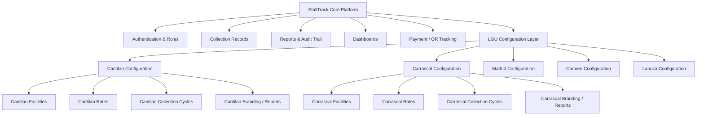
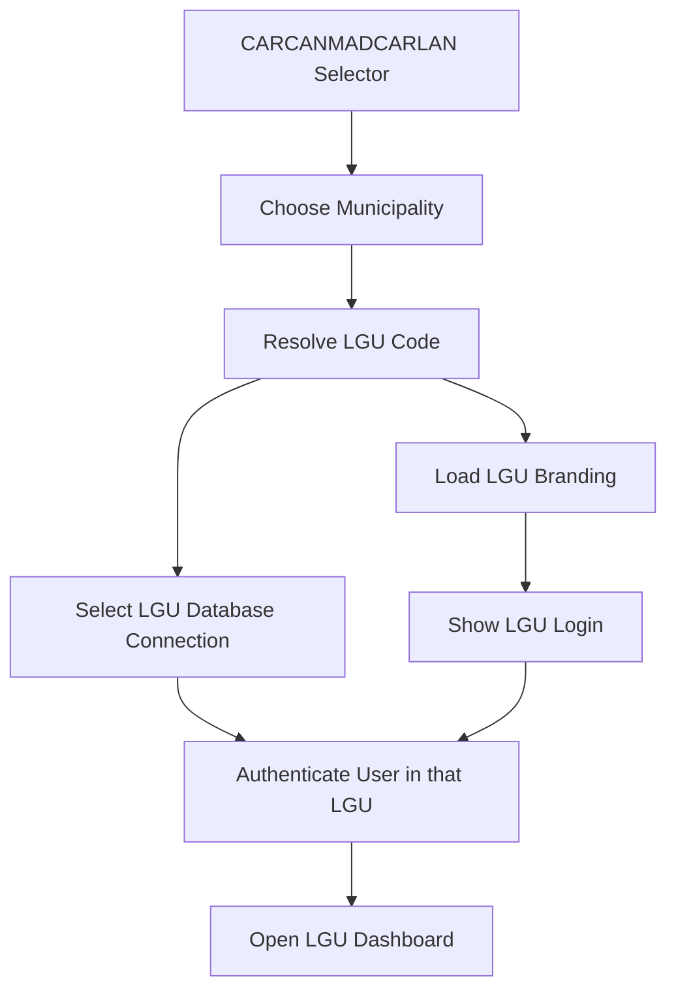
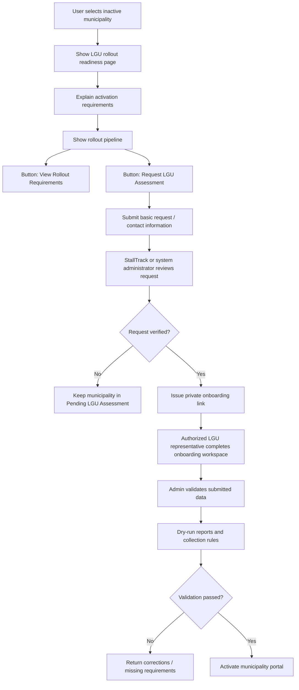
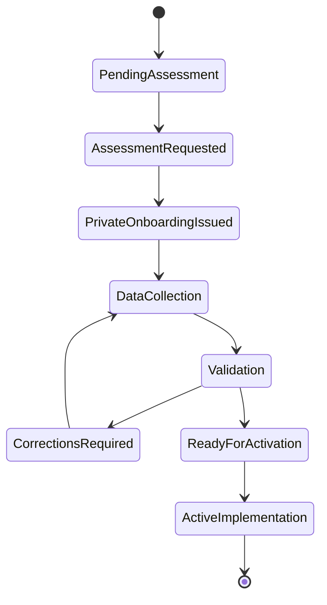

# CARCANMADCARLAN Multi-LGU Architecture & Migration Design

**Status:** Design / specification only — **not for implementation yet**
**Author:** Engineering
**Date:** 2026-06-29
**Primary implementation:** Cantilan EEMO remains the live/default system
**Expansion view:** CARCANMADCARLAN readiness for Carrascal, Cantilan, Madrid, Carmen, and Lanuza

---

## 1. Short Answer

StallTrack should **not** become five separate custom applications.

The recommended solution is:

> **One StallTrack core platform, with each LGU configured separately.**

That means Cantilan, Carrascal, Madrid, Carmen, and Lanuza can share the same system foundation while each municipality keeps its own:

- official name, seal/logo, address, report headers, and local office label
- facilities
- fee rates
- collection cycles
- collectors/admins
- payors/vendors/stalls/contracts
- official receipt series
- reports and operational records

The system should be **configurable per LGU**, not copied and rewritten per LGU.

---

## 2. Why This Matters

The current EEMO system is built primarily for **Cantilan**. The panel direction is that the system should also be presentable as a possible CARCANMADCARLAN platform:

> **CAR**rascal · **CAN**tilan · **MAD**rid · **CAR**men · **LAN**uza

The hard part is that the other LGUs may not have the same economic enterprise structure as Cantilan.

For example:

- one LGU may have a public market but no iceplant
- one LGU may use monthly rental for a facility
- another may collect daily fees
- another may collect per trip, per head, per kilo, or by another local ordinance rule
- each LGU can have different rates and local rules

Because of this, the system must not assume that every LGU has the exact same facilities as Cantilan.

But the solution is also **not** to build a separate app for every municipality. That would create duplicated code, duplicated bugs, and high maintenance cost.

The better approach is:

> Keep the common platform shared. Move the LGU-specific values into data/configuration.

---

## 3. Mental Model

Use this simple model when explaining the architecture:



### Rule of thumb

| Question | Design answer |
|---|---|
| Is it common to all LGUs? | Keep it in the StallTrack core platform. |
| Is it different per LGU? | Store it as configuration/data. |
| Is it a truly new collection behavior? | Add a new facility/billing type only after studying that LGU. |
| Is it only a different rate/name/logo? | Do not write new code; configure it. |

---

## 4. Do Not Build Separate LGU Projects

Do **not** create:

```text
EEMOCantilanSDS.Cantilan
EEMOCantilanSDS.Carrascal
EEMOCantilanSDS.Madrid
EEMOCantilanSDS.Carmen
EEMOCantilanSDS.Lanuza
```

That would be the wrong direction.

It causes:

- repeated business logic
- separate bugs per municipality
- harder testing
- harder deployment
- inconsistent reports
- expensive maintenance
- future difficulty if the province wants consolidated reporting

Instead, the project should remain:

```text
EEMOCantilanSDS.Api
EEMOCantilanSDS.Application
EEMOCantilanSDS.Domain
EEMOCantilanSDS.Infrastructure
EEMOCantilanSDS.Client
EEMOCantilanSDS.Mobile
```

Then LGU differences are handled by configuration and tenant resolution.

---

## 5. Core Platform vs LGU Configuration

### Shared core platform

These should remain common:

- authentication and role-based access
- collectors/admin/head workflows
- collection records
- payment recording
- online payment readiness
- official receipt tracking
- reports engine
- audit trail
- dashboards
- export/print behavior
- mobile collector app structure

### Per-LGU configuration

These should become configurable:

- municipality name
- seal/logo
- address
- report header
- office label
- facilities
- facility acronyms
- rates and fees
- collection cycle
- due rules
- penalty/grace rules if required
- OR series
- payment account/configuration

This lets Cantilan stay stable while still proving that the system can adapt to other municipalities.

---

## 6. Recommended Data Model Direction

### 6.1 Municipality / LGU

Each LGU should eventually have a configuration record.

```text
Municipality
- Id
- Code              // CANTILAN, CARRASCAL, MADRID, CARMEN, LANUZA
- Name
- Province
- Address
- SealPath
- OfficeName        // e.g. EEMO, Economic Enterprise Office, etc.
- IsDefault
- IsActive
```

Cantilan is seeded as the default.

### 6.2 Facility

Facilities should eventually become per-LGU data, not hardcoded only as Cantilan enum values.

```text
Facility
- Id
- MunicipalityId
- Code
- Name
- FacilityType
- IsActive
```

Examples:

```text
Cantilan:
- New Public Market
- Tampak Commercial Center
- New Commercial Center
- BBQ Stand
- Iceplant
- Slaughterhouse
- Transport Terminal
- Tabo-an Public Market

Carrascal:
- To be studied

Madrid:
- To be studied

Carmen:
- To be studied

Lanuza:
- To be studied
```

The other LGUs should not be guessed blindly. Their actual facilities must be validated before implementation.

### 6.3 Facility Type / Billing Archetype

This is the most important concept.

Even if each LGU has different facilities, many facilities will follow reusable billing patterns.

```text
FacilityType / Billing Archetype
- DailyStall
- MonthlyRental
- WeeklyMarket
- PerTrip
- PerHead
- PerKilo
- Custom
```

Examples:

| Facility type | Meaning | Cantilan example |
|---|---|---|
| `DailyStall` | daily collection per stall/vendor | New Public Market |
| `MonthlyRental` | fixed monthly rental | TCC, NCC, BBQ, Iceplant |
| `WeeklyMarket` | market-day based collection | Tabo-an Public Market |
| `PerTrip` | per trip collection | Transport Terminal |
| `PerHead` | per animal/head transaction | Slaughterhouse |
| `PerKilo` | per kilogram transaction | fish/ice-related fee if needed |
| `Custom` | requires study before implementation | unknown LGU-specific case |

The goal is to reuse collection behavior wherever possible.

### 6.4 Rate / Fee Configuration

Rates should not remain hardcoded forever.

```text
Rate
- FacilityId
- RateType
- Amount
- EffectiveDate
- IsActive
```

Examples:

```text
Cantilan NPM: ₱30/day
Madrid Public Market: value to be confirmed
Carmen Terminal: value to be confirmed
Lanuza Slaughterhouse: value to be confirmed
```

The system should support different rates per LGU because rates are usually based on local ordinance or local policy.

### 6.5 Collection Rule

Collection cycle should also be configurable.

```text
CollectionRule
- FacilityId
- Cycle              // Daily, Weekly, Monthly, PerTransaction
- DueRule
- GracePeriod
- PenaltyRule
```

This is where custom daily/monthly behavior belongs.

Do not create separate code such as:

```text
CarrascalDailyCollectionService
MadridMonthlyCollectionService
CarmenTerminalService
```

Prefer:

```text
Facility has a collection cycle.
Facility has rate rules.
Facility has due rules.
```

---

## 7. Isolation Model

Because these are separate government units, financial data isolation matters.

Three options exist:

| Model | Isolation | Cost | Risk |
|---|---|---|---|
| Shared database with `MunicipalityId` | logical isolation | lowest | one missed filter can leak data |
| **Database per LGU, one shared codebase** | strong isolation | medium | safer for government data |
| Separate deployed app per LGU | strong isolation | highest | operationally heavy |

### Recommended direction

> **Selected model (authoritative — see `CARCANMADCARLAN-production-roadmap.md`): one shared codebase
> AND one shared database, with strict tenant isolation via `MunicipalityId`, EF Core global query
> filters, tenant-stamped writes, and isolation tests.**

Database-per-LGU (described below) is retained only as a **deferred future option**, to be adopted for a
specific LGU only if legally or operationally required. It is not the current direction: it multiplies EF
migrations across N databases and makes consolidated provincial reporting far harder.

Deferred option — database per LGU (one shared codebase):

- Cantilan / Carrascal / Madrid / Carmen / Lanuza each with its own database.
- Strongest physical isolation, but higher operational cost and harder cross-LGU reporting.

This gives strong government data isolation while avoiding five separate applications.

---

## 8. Tenant / LGU Resolution

The system needs to know which LGU the user is entering.

Possible future flow:



Important:

- the selector is not the real security boundary
- the selected LGU must map to the correct database/connection
- after login, ordinary users should not freely switch LGUs
- future provincial/super-admin access can be considered separately

Cantilan remains the default if no other LGU is active.

---

## 9. Mapping the User's Flow Diagram

The current flow sketch is useful because it shows the intuition:

- Cantilan has known facilities
- other LGUs may have different economics
- some parts are custom
- some parts are shared

The improvement is to rename “custom” into clearer architecture terms:

| Flow diagram idea | Architecture term |
|---|---|
| Custom data | LGU configuration |
| Custom monthly | Collection rule: monthly cycle |
| Custom daily | Collection rule: daily cycle |
| Custom facilities | Per-LGU facility catalog |
| If they have custom | New facility type only after validation |

The better professional phrasing:

> Each LGU can configure its own facility catalog, rates, and collection cycles. Where the behavior matches an existing collection archetype, no new code is required. If an LGU has a truly unique revenue activity, a new billing archetype may be added after requirements validation.

---

## 10. Migration Strategy

Do not refactor everything immediately.

### Phase 0 — Current capstone / presentation phase

- Keep Cantilan as the working implementation.
- Use the CARCANMADCARLAN selector as a presentation/readiness layer.
- Document the architecture.
- Do not wire real multi-LGU tenancy yet.

### Phase 1 — Branding/config extraction

- Move municipality name, seal, report headers, and office labels into config.
- Keep values identical for Cantilan.
- No behavior change.

### Phase 2 — Municipality scaffold

- Add `Municipality` configuration.
- Seed Cantilan as default.
- Add LGU registry concept.
- Still no other real LGU data.

### Phase 3 — Facility model cleanup

- Introduce `FacilityType`.
- Keep current `FacilityCode` during migration.
- Seed Cantilan's current facilities as data.
- Use snapshot tests before changing financial/report logic.

### Phase 4 — Rates and collection rules

- Move hardcoded rates into per-facility/per-LGU config.
- Move collection cycles into data rules.
- Preserve Cantilan output.

### Phase 5 — Real tenant/database resolution

- Resolve LGU from selector/subdomain/account.
- Connect to the correct LGU database.
- Ensure mobile offline cache is namespaced by LGU.

### Phase 6 — First real non-Cantilan onboarding

- Study one LGU first.
- Confirm facilities, rates, and collection rules.
- Map them to existing billing archetypes.
- Add new archetype only if truly needed.

---

## 11. Testing Rules

Financial behavior must not be changed casually.

Before refactoring reports, dashboard totals, compliance, collection rate, outstanding balances, or obligations:

1. create snapshot/characterization tests for current Cantilan numbers
2. make the migration/refactor
3. prove Cantilan results did not change unless intentionally updated

This protects the live Cantilan implementation.

Minimum areas to snapshot:

- dashboard totals
- month-end report
- financial report
- collection rate
- outstanding/unpaid totals
- partial/paid/unpaid counts
- NPM daily obligations
- monthly rental obligations
- absent/excused/closed behavior

---

## 12. Mobile and Offline Considerations

If the system becomes multi-LGU later, the mobile app must not mix cached data between LGUs.

Future cache keys should include LGU scope.

Example:

```text
cantilan|records|2026-06
carrascal|records|2026-06
madrid|records|2026-06
```

Pending offline operations must also carry LGU context.

This avoids a collector seeing or syncing records into the wrong municipality.

---

## 13. What Not To Do

Do not:

- create one project layer per LGU
- fork the backend per municipality
- copy Cantilan code and rename it for another LGU
- assume every LGU has NPM/TCC/NCC/BBQ/ICE/SLH/TRM/TPM
- hardcode another LGU without validating its facilities/rates
- refactor financial calculations without snapshot tests
- expose LGU selection without real tenant/database binding when it becomes functional

---

## 14. Panel-Ready Explanation

Use this explanation:

> Cantilan remains the primary implemented LGU. For CARCANMADCARLAN expansion, StallTrack will not duplicate the system per municipality. Instead, it will use a configurable multi-LGU model where each municipality can define its own facilities, rates, collection cycles, official branding, and reporting headers while sharing the same core platform for authentication, collection records, reports, audit trail, dashboards, and payment tracking.

If asked why this is better:

> This approach preserves consistency and reduces maintenance while still respecting each LGU's local economic enterprise structure and ordinance-based rates.

If asked whether other LGUs are already implemented:

> No. Cantilan is the live baseline. The other LGUs are represented as future-ready expansion slots until their actual facilities, rates, and rules are validated.

---

## 15. Summary

- **Do not build five custom apps.**
- **Build one StallTrack core platform.**
- **Configure each LGU separately.**
- **Cantilan stays stable as the default implementation.**
- **Other LGUs require requirements gathering before onboarding.**
- **Use facility/billing archetypes to avoid rewriting code for every LGU.**
- **Use database-per-LGU if real government data isolation becomes required.**
- **Use snapshot tests before touching financial/report calculations.**

This gives the project a professional and realistic path: Cantilan-first today, CARCANMADCARLAN-ready tomorrow.

---

## 16. Municipality Selection and LGU Onboarding Pipeline

This section defines the recommended professional flow when a user selects a municipality from the CARCANMADCARLAN selector.

The selector should not behave like a raw setup form. It should work as a formal entry point:

- active municipalities route to their official portal
- inactive municipalities show rollout status and requirements
- detailed facility/rate/document collection happens only through a private onboarding workspace

This keeps the public page clean, avoids fake data, and prevents sensitive LGU documents from being uploaded by unverified visitors.

### 16.1 Municipality selector behavior

When the user opens:

```text
/select-municipality
```

The page displays the five CARCANMADCARLAN municipalities:

- Carrascal
- Cantilan
- Madrid
- Carmen
- Lanuza

Each municipality card should have a clear activation status.

| Municipality state | Recommended label | Behavior |
|---|---|---|
| Live / implemented | `Active Implementation` | Continue to official LGU portal/login |
| Prepared but not implemented | `Pending LGU Assessment` | Open rollout readiness/instructions page |
| Under setup | `Onboarding in Progress` | Show controlled status page, not dashboard |
| Ready after validation | `Ready for Activation` | Allow authorized activation only |

Cantilan should remain:

```text
Cantilan - Active Implementation
```

Other municipalities should remain:

```text
Pending LGU Assessment
```

until their real facilities, rates, local rules, users, and authorization documents are validated.

### 16.2 Inactive municipality click flow

If a visitor clicks Carrascal, Madrid, Carmen, or Lanuza while that LGU is not active yet, the system should not show a login page or fake dashboard.

Recommended flow:



Professional inactive-page message:

> This municipality is prepared for future StallTrack rollout but is not yet activated. Activation requires official LGU coordination, facility validation, rate confirmation, collection-rule mapping, and administrative approval.

Recommended buttons:

- `View Rollout Requirements`
- `Request LGU Assessment`

Avoid public buttons like:

- `Upload Documents Now`
- `Create LGU`
- `Start Live Portal`

Those actions should require authorization.

### 16.3 Public rollout requirements page

The public requirements page can describe what is needed without accepting sensitive files.

Recommended content:

1. **Official LGU coordination**
   - confirm the responsible office
   - identify the focal person
   - confirm the intended scope of rollout

2. **Facility inventory**
   - list public markets, commercial rentals, terminals, slaughterhouse operations, weekly markets, or other LGU-managed revenue activities
   - identify whether each facility is daily, weekly, monthly, per trip, per head, per kilo, or custom

3. **Rate and ordinance review**
   - confirm rate schedules
   - confirm legal basis or local policy reference
   - confirm effective dates

4. **Collection cycle mapping**
   - daily collection
   - weekly market-day collection
   - monthly rental
   - per-transaction collection
   - custom collection behavior requiring further study

5. **Payor/stallholder data preparation**
   - vendor/payor names
   - stall or space numbers
   - contract dates
   - rental or fee amount
   - facility assignment

6. **Authorized users**
   - LGU administrator
   - EEMO/head office user
   - collectors
   - auditors/view-only users if needed

7. **Report and receipt setup**
   - official report header
   - office name
   - seal/logo
   - official receipt series or tracking policy
   - payment account configuration if online payments are enabled

8. **Validation and dry run**
   - test reports
   - verify totals
   - verify collection obligations
   - verify sample payor records
   - verify dashboard and mobile views

9. **Activation approval**
   - activate only after the LGU setup passes review

This page should be informational and professional, not a public document-upload page.

### 16.4 Private onboarding workspace

Detailed onboarding should happen through a private secure link, issued only after an assessment request is reviewed.

The private onboarding workspace can contain the actual forms and uploads.

Recommended onboarding steps:

```text
Step 1 - LGU Profile
Step 2 - Authorization Documents
Step 3 - Facility Inventory
Step 4 - Collection Rules and Rates
Step 5 - Payor / Stallholder Import
Step 6 - Users and Roles
Step 7 - Report / Receipt Configuration
Step 8 - Validation and Dry Run
Step 9 - Activation Review
```

#### Step 1 - LGU Profile

Collect:

- municipality name
- province
- office name
- office address
- official seal/logo
- authorized focal person
- contact number and official email

#### Step 2 - Authorization Documents

Collect only inside the private workspace:

- mayor or authorized official endorsement
- authorization letter or memorandum
- designated focal person confirmation
- ordinance/rate schedule reference
- data coordination acknowledgement if required

If signatures are required, this is the correct place to collect them.

Do not collect mayor signatures or formal documents from the public selector page.

#### Step 3 - Facility Inventory

Collect each facility and map it to a billing archetype:

| Facility information | Purpose |
|---|---|
| Facility name | Official display/report name |
| Facility code/acronym | Short internal reference |
| Facility type | Daily, monthly, weekly, per trip, per head, per kilo, custom |
| Operating schedule | Needed for daily/weekly collection |
| Sections/areas | Needed for markets and stall grouping |
| Active/inactive status | Controls whether it appears in the portal |

#### Step 4 - Collection Rules and Rates

For each facility, collect:

- rate amount
- rate type
- billing cycle
- due rule
- grace period if any
- penalty rule if any
- effective date
- ordinance or policy reference

If the LGU has a collection behavior that does not match existing archetypes, mark it:

```text
Custom Review Required
```

Do not immediately create custom code until the rule is validated.

#### Step 5 - Payor / Stallholder Import

Collect:

- payor/vendor name
- stall/space number
- facility
- section/area
- contract start date
- contract duration or expiry date
- monthly/daily/weekly rate
- ownership/occupancy details if applicable

The import should be validated before activation.

#### Step 6 - Users and Roles

Collect:

- LGU admin/head account
- collector accounts
- optional auditor/view-only users
- assigned facilities per collector

Each user must belong to the correct municipality scope.

#### Step 7 - Report / Receipt Configuration

Collect:

- official report heading
- municipal seal/logo
- office label
- prepared/reviewed by labels
- OR number policy
- receipt validation rules
- online payment account if enabled

#### Step 8 - Validation and Dry Run

Before going live:

- generate sample dashboard totals
- generate sample month-end report
- test mobile collection views
- test payor balances
- test paid/partial/unpaid/absent/excused scenarios
- verify report headers and branding
- verify no Cantilan data is affected

Snapshot tests should be required before changing financial logic.

#### Step 9 - Activation Review

Only activate after:

- required data is complete
- rates are validated
- facility mapping is approved
- users are configured
- sample reports are checked
- LGU authorization is confirmed

Activation changes the municipality state from:

```text
Pending LGU Assessment
```

to:

```text
Active Implementation
```

### 16.5 Recommended status lifecycle



Status definitions:

| Status | Meaning |
|---|---|
| `PendingAssessment` | Municipality is shown as a future rollout slot only |
| `AssessmentRequested` | Someone submitted a request for review |
| `PrivateOnboardingIssued` | A secure onboarding link was issued |
| `DataCollection` | LGU profile, facilities, rates, and users are being gathered |
| `Validation` | Submitted setup is being checked through dry-run reports |
| `CorrectionsRequired` | Missing/incorrect items must be fixed |
| `ReadyForActivation` | Configuration is approved but not yet live |
| `ActiveImplementation` | Municipality can route to the real portal |

### 16.6 Security and professionalism rules

Rules:

- The selector page is not the security boundary.
- Public visitors should not upload sensitive LGU documents.
- Private onboarding links should expire or require authentication.
- Only authorized administrators should activate an LGU.
- Other LGUs must not access Cantilan data.
- Mobile offline cache must include LGU scope before real multi-LGU operation.
- No fake dashboards should be shown for inactive LGUs.
- No assumptions should be made about facilities/rates without validation.

Professional stance:

> StallTrack may present CARCANMADCARLAN readiness publicly, but actual LGU activation requires formal assessment, validated facility and rate data, authorized user setup, and dry-run verification before the municipality becomes operational.
